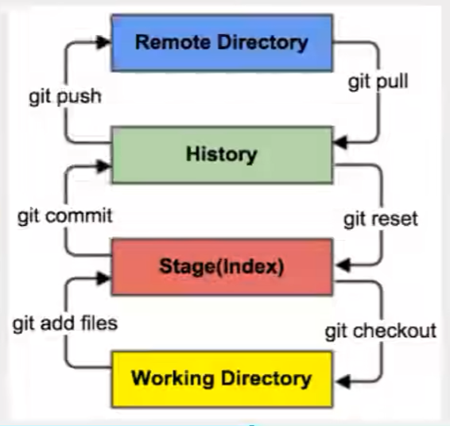
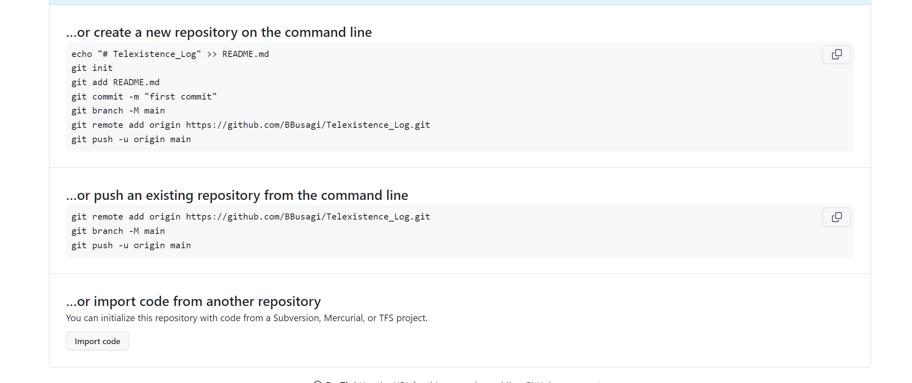

Tutorial URL:  
30 天精通 Git 版本控制  
https://github.com/doggy8088/Learn-Git-in-30-days/blob/master/zh-cn/README.md  
**另外详见Git笔记**

### Git逻辑
四大状态：
Untracked，Unmodify，Modified，Staged

### 添加到库

### Git Bash
由于窗口显示有限，持续按回车显示所有历史记录

### 变量设置
git config -l
git config --system -l
path:git/MINGW64/etc/gitconfig

git config --global -l
path:C:\Users\BBRabbit\gitconfig
Setting: 
git config --global user.name "[name]"
git config --global user.email "[email]"

### 删除指令
git branch -a  
git fetch -p

git branch -d <localbranch>

git branch -r  
git push -d origin <remotebranch>
远程支线

### 大型文件处理
https://docs.github.com/en/repositories/working-with-files/managing-large-files/about-large-files-on-github